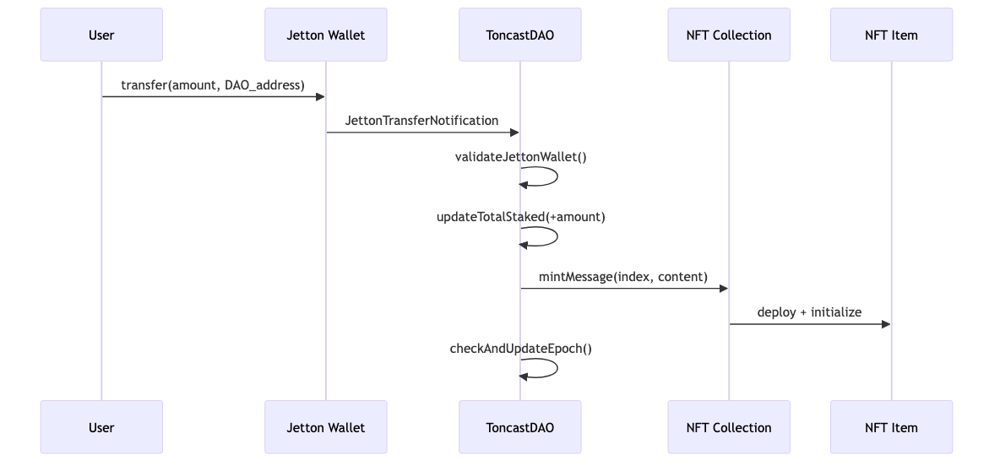
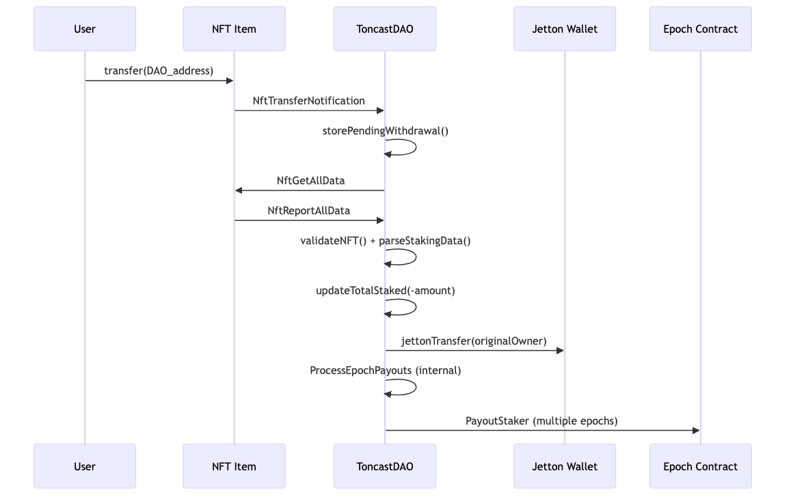
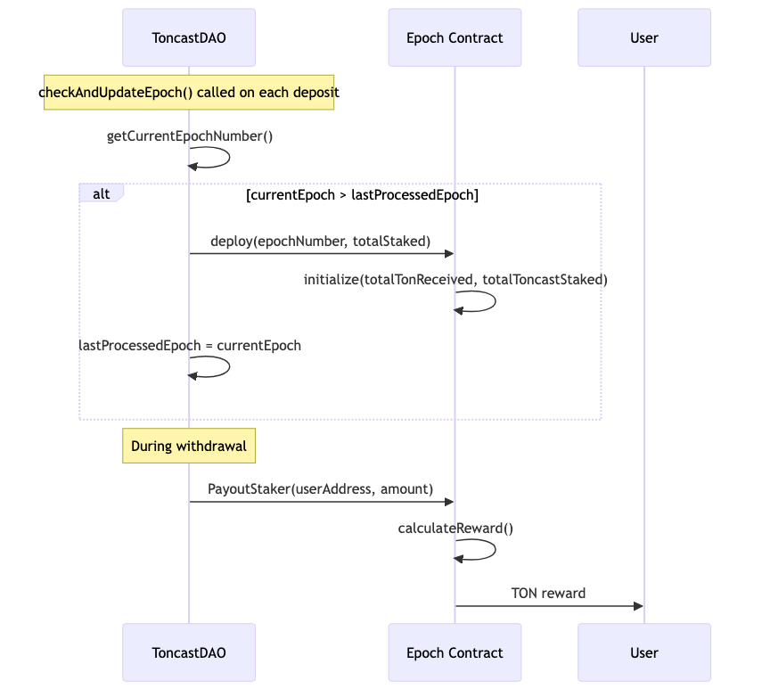

# 🎯 ToncastDAO

Smart contract system for Toncast DAO that allows users to stake TONCAST tokens, receive membership NFTs, and earn epoch rewards.

## 🪙 Toncast Jetton Addresses

- **🧪 Testnet**: `kQBM0jlIe1_IGNJmHxV3EYDAswxLQhIxZnzvResvWbtPTCAV`
- **🚀 Mainnet**: `EQCwIlIRZRVzdwS-iY7QJngnVCU8UMKfPhWr_KkZoQ6Mckju`

## 🔄 Contract Interaction Flows

### 1. 💰 DEPOSIT FLOW (User Stakes Tokens)



**Process:**
1. User sends TONCAST tokens to DAO via jetton transfer
2. Jetton Wallet notifies DAO about the transfer
3. DAO validates the jetton wallet address
4. DAO updates total staked amount
5. DAO sends mint message to NFT Collection
6. NFT Collection deploys and initializes new NFT Item
7. DAO checks and updates current epoch

### 2. 🏦 WITHDRAWAL FLOW (User Withdraws Tokens)



**Process:**
1. User transfers NFT to DAO address
2. NFT Item notifies DAO about the transfer
3. DAO stores pending withdrawal information
4. DAO requests all data from NFT Item
5. NFT Item reports back with staking data
6. DAO validates NFT authenticity and parses staking data
7. DAO updates total staked amount (decreases)
8. DAO transfers TONCAST tokens back to original owner
9. DAO processes epoch payouts internally
10. DAO sends payout requests to multiple Epoch Contracts

### 3. ⏰ EPOCH SYSTEM (Reward Distribution)



**Process:**
1. **Epoch Creation**: `checkAndUpdateEpoch()` is called on each deposit
2. **Time Check**: DAO calculates current epoch number based on time
3. **Conditional Deployment**: If current epoch > last processed epoch:
   - DAO deploys new Epoch Contract with accumulated funds
   - Epoch Contract initializes with total TON received and total TONCAST staked
   - DAO updates last processed epoch number
4. **Reward Distribution**: During user withdrawal:
   - DAO sends `PayoutStaker` message to relevant Epoch Contracts
   - Each Epoch Contract calculates proportional reward
   - Epoch Contract sends TON reward directly to user

## ⚙️ Contract Parameters

### 📝 Basic Parameters
- **👤 Owner**: Contract owner address (immutable after deployment)
- **💰 Minimum deposit**: 1 TONCAST token (configurable during deployment)
- **🖼️ NFT Collection**: Address of the NFT collection contract for minting membership NFTs
- **👛 Jetton Wallet**: DAO's Toncast jetton wallet address for receiving deposits
- **🏷️ NFT Name Prefix**: Prefix for NFT names (e.g., "ToncastDAO Member") - **immutable**
- **🌐 NFT Image URL**: Base URL template for NFT images - **immutable**

### ⏰ Epoch System
- **📅 Epoch Duration**: Configurable duration (default: 30 days for mainnet, customizable during deployment)
- **💎 Reward Distribution**: Automatic distribution of accumulated TON to epoch participants
- **📊 Staking Tracking**: Total TONCAST staked is tracked across all epochs
- **⚠️ Timing**: Rewards for epoch N are available only when epoch N+1 begins

## 🎨 NFT Metadata

Each minted NFT uses custom on-chain metadata (TEP-64 standard):
- 💵 Amount of TONCAST tokens deposited
- ⏱️ Timestamp of the deposit  
- 📍 DAO contract address
- 🖼️ Dynamic image URL based on staking parameters

**Staking Data Structure**: `[coins amount][uint64 timestamp][address dao_address]`
**Human-readable Description**: `"Toncast staked: {amount} at timestamp: {timestamp} in contract: {dao_address}"`
**Dynamic Image URL**: `{baseUrl}{amount}-{timestamp}-{dao_address}.png`

> The NFT collection uses a custom FunC implementation with on-chain metadata storage, ensuring all data is stored directly on the blockchain.

## 🔄 Epoch Reward System

### How It Works
1. **⚡ Staking**: Users deposit TONCAST tokens and receive NFT certificates
2. **📈 Epoch Funding**: When an epoch ends, all accumulated TON is sent to that epoch's contract
3. **💸 Withdrawals**: When users withdraw their NFTs, they automatically receive rewards from all completed epochs
4. **🎁 Payouts**: Each epoch contract calculates and distributes proportional rewards based on staked amounts

### Key Features
- **⏰ Automatic Epoch Creation**: New epochs are created automatically when time advances
- **💰 Proportional Rewards**: `stakerReward = (stakerAmount / totalStaked) * totalTonReceived`
- **⚠️ Minimum Payout**: 0.005 TON per epoch (prevents dust transactions)
- **🔄 Batch Processing**: Up to 100 epochs processed per transaction
- **🎯 Selective Funding**: Only epochs with meaningful TON amounts (>0.1 TON) are funded
- **🔒 Secure Validation**: Multiple checks ensure NFTs belong to the correct DAO and collection

### Special Rules
- ✅ **Epoch 0 Special Case**: Participants in epoch 0 receive rewards
- 💰 **Automatic Funding**: All TON received by DAO goes to epoch rewards
- 🚫 **SendIgnoreErrors**: Failed epoch payouts are silently ignored (prevents blocking withdrawals)

## 👑 Owner Functions

The contract owner has **limited privileges** for security:
- 🔒 **No Parameter Updates**: NFT name prefix and image URL are immutable after deployment
- ⚙️ **No Emergency Stop**: Contract operates autonomously without owner intervention
- 🎯 **Decentralized Design**: Owner cannot modify staking parameters or withdraw user funds

> This design ensures maximum security and decentralization - the owner cannot rug pull or modify critical parameters.

## 📁 Project Structure

- 📂 `contracts` - Source code of all smart contracts
  - `toncast_d_a_o.tact` - Main DAO contract
  - `toncast_dao_epoch.tact` - Epoch reward distribution contract
  - `messages.tact` - Shared message and struct definitions
- 📂 `func_contracts` - FunC contracts for NFT and Jetton functionality
- 📂 `tests` - Comprehensive test suite
- 📂 `scripts` - Deployment and utility scripts
- 📂 `build` - Compiled contracts and bindings
- 📂 `docs` - Documentation and visual diagrams
  - 📂 `images` - PNG diagrams of contract interactions
  - `*.mmd` - Mermaid source files for diagrams

## 🚀 How to Use

### 🔨 Build

```bash
npx blueprint build
# or
yarn blueprint build
```

### 🧪 Test

```bash
npx blueprint test
# or
yarn blueprint test
```

### 📤 Deploy or Run Scripts

```bash
npx blueprint run
# or
yarn blueprint run
```

### 🔗 Generate TonKeeper Deployment Link

To generate a deeplink for deploying the contract via TonKeeper/Tonhub:

```bash
npx blueprint run generateDeployLink
```

This will:
1. 📝 Ask for all contract parameters including epoch duration
2. 🔗 Generate a `ton://` deeplink for TonKeeper/Tonhub
3. 📊 Display deployment information in console
4. ⚡ Provide instant deployment capability

### ➕ Add a New Contract

```bash
npx blueprint create ContractName
# or
yarn blueprint create ContractName
```

## 🧮 Technical Details

### Smart Contract Architecture
- **Main DAO Contract**: Manages staking, NFT minting, and epoch transitions
- **Epoch Contracts**: Individual contracts for each epoch that handle reward distribution
- **NFT Collection**: Custom implementation with on-chain TEP-64 metadata ([toncast-dao-nft](https://github.com/TonCast/toncast-dao-nft))
- **Jetton Integration**: Full support for TONCAST jetton ([toncast-minter-contract](https://github.com/TonCast/toncast-minter-contract)) deposits and withdrawals

### Key Features
- ✨ **Automatic Epoch Management**: Epochs are created and funded automatically
- 🔐 **Secure Withdrawal Process**: Multiple validation checks prevent fraud
- 📈 **Proportional Reward Distribution**: Fair rewards based on stake size and time
- 🛡️ **Protection Against Exploits**: No double withdrawals, no fake NFTs
- ⚡ **Gas-Efficient Batch Processing**: Handles thousands of epochs efficiently
- 🎯 **Minimum Payout Thresholds**: Prevents spam with dust amounts
- 🔒 **Immutable Parameters**: No owner can change critical settings after deployment
- 💎 **True Decentralization**: No emergency stops or admin functions

## ⚠️ Important Technical Notes

### 🔒 Security Considerations
- **Jetton Wallet Validation**: Only notifications from the correct jetton wallet are accepted
- **NFT Collection Verification**: NFTs must be from the DAO's own collection
- **Address Calculation**: All contract addresses are calculated deterministically
- **Staking Data Integrity**: NFT metadata contains cryptographic proof of staking parameters

### 💰 Economic Model
- **Epoch Funding**: DAO automatically sends all accumulated TON to epoch contracts
- **Funding Threshold**: Only epochs with >0.1 TON are funded (prevents spam)
- **Gas Estimation**: Interface should calculate proper gas for epoch processing
- **Reward Timing**: Rewards for epoch N are only available when epoch N+1 begins

### 🛠️ Integration Guidelines
- **Use Official Interface**: Direct contract calls may fail due to insufficient gas
- **Proper Gas Calculation**: Withdrawal gas depends on number of epochs to process
- **NFT Transfer**: Send NFT to DAO address to initiate withdrawal
- **Batch Limits**: Maximum 100 epochs processed per transaction

## 🔗 Related Repositories

- 🖼️ **[toncast-dao-nft](https://github.com/TonCast/toncast-dao-nft)** - Custom NFT collection with on-chain TEP-64 metadata
- 🪙 **[toncast-minter-contract](https://github.com/TonCast/toncast-minter-contract)** - TONCAST jetton minter and deployer

## 📜 License

This project is licensed under the MIT License - see the [LICENSE](LICENSE) file for details.

**MIT License** - Free for commercial and non-commercial use, modification, and distribution.

---

© 2025 Toncast Foundation. Part of the Toncast ecosystem.