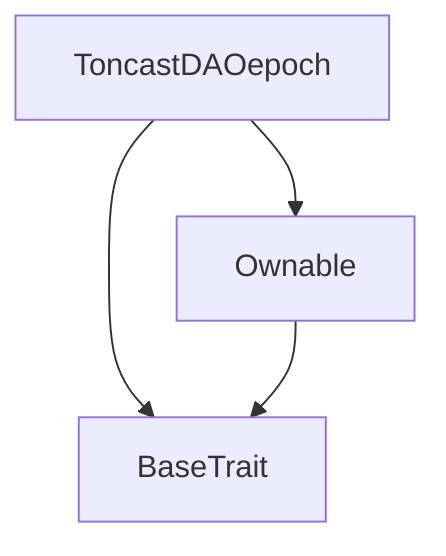
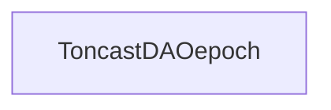

# Tact compilation report
Contract: ToncastDAOepoch
BoC Size: 867 bytes

## Structures (Structs and Messages)
Total structures: 26

### DataSize
TL-B: `_ cells:int257 bits:int257 refs:int257 = DataSize`
Signature: `DataSize{cells:int257,bits:int257,refs:int257}`

### SignedBundle
TL-B: `_ signature:fixed_bytes64 signedData:remainder<slice> = SignedBundle`
Signature: `SignedBundle{signature:fixed_bytes64,signedData:remainder<slice>}`

### StateInit
TL-B: `_ code:^cell data:^cell = StateInit`
Signature: `StateInit{code:^cell,data:^cell}`

### Context
TL-B: `_ bounceable:bool sender:address value:int257 raw:^slice = Context`
Signature: `Context{bounceable:bool,sender:address,value:int257,raw:^slice}`

### SendParameters
TL-B: `_ mode:int257 body:Maybe ^cell code:Maybe ^cell data:Maybe ^cell value:int257 to:address bounce:bool = SendParameters`
Signature: `SendParameters{mode:int257,body:Maybe ^cell,code:Maybe ^cell,data:Maybe ^cell,value:int257,to:address,bounce:bool}`

### MessageParameters
TL-B: `_ mode:int257 body:Maybe ^cell value:int257 to:address bounce:bool = MessageParameters`
Signature: `MessageParameters{mode:int257,body:Maybe ^cell,value:int257,to:address,bounce:bool}`

### DeployParameters
TL-B: `_ mode:int257 body:Maybe ^cell value:int257 bounce:bool init:StateInit{code:^cell,data:^cell} = DeployParameters`
Signature: `DeployParameters{mode:int257,body:Maybe ^cell,value:int257,bounce:bool,init:StateInit{code:^cell,data:^cell}}`

### StdAddress
TL-B: `_ workchain:int8 address:uint256 = StdAddress`
Signature: `StdAddress{workchain:int8,address:uint256}`

### VarAddress
TL-B: `_ workchain:int32 address:^slice = VarAddress`
Signature: `VarAddress{workchain:int32,address:^slice}`

### BasechainAddress
TL-B: `_ hash:Maybe int257 = BasechainAddress`
Signature: `BasechainAddress{hash:Maybe int257}`

### ChangeOwner
TL-B: `change_owner#819dbe99 queryId:uint64 newOwner:address = ChangeOwner`
Signature: `ChangeOwner{queryId:uint64,newOwner:address}`

### ChangeOwnerOk
TL-B: `change_owner_ok#327b2b4a queryId:uint64 newOwner:address = ChangeOwnerOk`
Signature: `ChangeOwnerOk{queryId:uint64,newOwner:address}`

### DeployEpoch
TL-B: `deploy_epoch#5a75ae3e totalToncastStaked:coins = DeployEpoch`
Signature: `DeployEpoch{totalToncastStaked:coins}`

### PayoutStaker
TL-B: `payout_staker#3a9b4f22 queryId:uint64 stakerAddress:address stakerToncastAmount:coins = PayoutStaker`
Signature: `PayoutStaker{queryId:uint64,stakerAddress:address,stakerToncastAmount:coins}`

### ProcessEpochPayouts
TL-B: `process_epoch_payouts#8d4b6e9f userAddress:address withdrawnAmount:coins startEpoch:uint32 endEpoch:uint32 = ProcessEpochPayouts`
Signature: `ProcessEpochPayouts{userAddress:address,withdrawnAmount:coins,startEpoch:uint32,endEpoch:uint32}`

### EpochData
TL-B: `_ epochNumber:uint32 totalTonReceived:coins totalToncastStaked:coins isInitialized:bool owner:address = EpochData`
Signature: `EpochData{epochNumber:uint32,totalTonReceived:coins,totalToncastStaked:coins,isInitialized:bool,owner:address}`

### JettonTransferNotification
TL-B: `jetton_transfer_notification#7362d09c queryId:uint64 amount:coins sender:address forwardPayload:remainder<slice> = JettonTransferNotification`
Signature: `JettonTransferNotification{queryId:uint64,amount:coins,sender:address,forwardPayload:remainder<slice>}`

### NftTransferNotification
TL-B: `nft_transfer_notification#05138d91 queryId:uint64 prevOwner:address forwardPayload:remainder<slice> = NftTransferNotification`
Signature: `NftTransferNotification{queryId:uint64,prevOwner:address,forwardPayload:remainder<slice>}`

### NftGetAllData
TL-B: `nft_get_all_data#3a3a3a3a queryId:uint64 = NftGetAllData`
Signature: `NftGetAllData{queryId:uint64}`

### NftReportAllData
TL-B: `nft_report_all_data#7b7b7b7b queryId:uint64 index:uint64 data:^cell = NftReportAllData`
Signature: `NftReportAllData{queryId:uint64,index:uint64,data:^cell}`

### StopAndRedirect
TL-B: `stop_and_redirect#53544f50 newDaoAddress:address = StopAndRedirect`
Signature: `StopAndRedirect{newDaoAddress:address}`

### JettonWalletData
TL-B: `_ balance:coins ownerAddress:address jettonMasterAddress:address jettonWalletCode:^cell = JettonWalletData`
Signature: `JettonWalletData{balance:coins,ownerAddress:address,jettonMasterAddress:address,jettonWalletCode:^cell}`

### StakingData
TL-B: `_ amount:coins timestamp:uint64 daoAddress:address = StakingData`
Signature: `StakingData{amount:coins,timestamp:uint64,daoAddress:address}`

### DAOEpochData
TL-B: `_ deployTime:uint64 currentRealTimeEpoch:uint32 epochDuration:uint32 currentStoredEpochNumber:uint32 totalCurrentlyStaked:coins = DAOEpochData`
Signature: `DAOEpochData{deployTime:uint64,currentRealTimeEpoch:uint32,epochDuration:uint32,currentStoredEpochNumber:uint32,totalCurrentlyStaked:coins}`

### DAOConfigData
TL-B: `_ nextItemIndex:uint64 nftCollectionAddress:address jettonMasterAddress:address jettonWalletAddress:address minDepositAmount:coins nftNamePrefix:^string nftImageUrl:^string isReadyToAcceptDeposits:bool stopped:bool newDaoAddress:address = DAOConfigData`
Signature: `DAOConfigData{nextItemIndex:uint64,nftCollectionAddress:address,jettonMasterAddress:address,jettonWalletAddress:address,minDepositAmount:coins,nftNamePrefix:^string,nftImageUrl:^string,isReadyToAcceptDeposits:bool,stopped:bool,newDaoAddress:address}`

### ToncastDAOepoch$Data
TL-B: `_ owner:address epochNumber:uint32 totalTonReceived:coins totalToncastStaked:coins isInitialized:bool = ToncastDAOepoch`
Signature: `ToncastDAOepoch{owner:address,epochNumber:uint32,totalTonReceived:coins,totalToncastStaked:coins,isInitialized:bool}`

## Get methods
Total get methods: 3

## getEpochData
No arguments

## calculateStakerReward
Argument: stakerToncastAmount

## owner
No arguments

## Exit codes
* 2: Stack underflow
* 3: Stack overflow
* 4: Integer overflow
* 5: Integer out of expected range
* 6: Invalid opcode
* 7: Type check error
* 8: Cell overflow
* 9: Cell underflow
* 10: Dictionary error
* 11: 'Unknown' error
* 12: Fatal error
* 13: Out of gas error
* 14: Virtualization error
* 32: Action list is invalid
* 33: Action list is too long
* 34: Action is invalid or not supported
* 35: Invalid source address in outbound message
* 36: Invalid destination address in outbound message
* 37: Not enough Toncoin
* 38: Not enough extra currencies
* 39: Outbound message does not fit into a cell after rewriting
* 40: Cannot process a message
* 41: Library reference is null
* 42: Library change action error
* 43: Exceeded maximum number of cells in the library or the maximum depth of the Merkle tree
* 50: Account state size exceeded limits
* 128: Null reference exception
* 129: Invalid serialization prefix
* 130: Invalid incoming message
* 131: Constraints error
* 132: Access denied
* 133: Contract stopped
* 134: Invalid argument
* 135: Code of a contract was not found
* 136: Invalid standard address
* 138: Not a basechain address

## Trait inheritance diagram

## Contract dependency diagram

